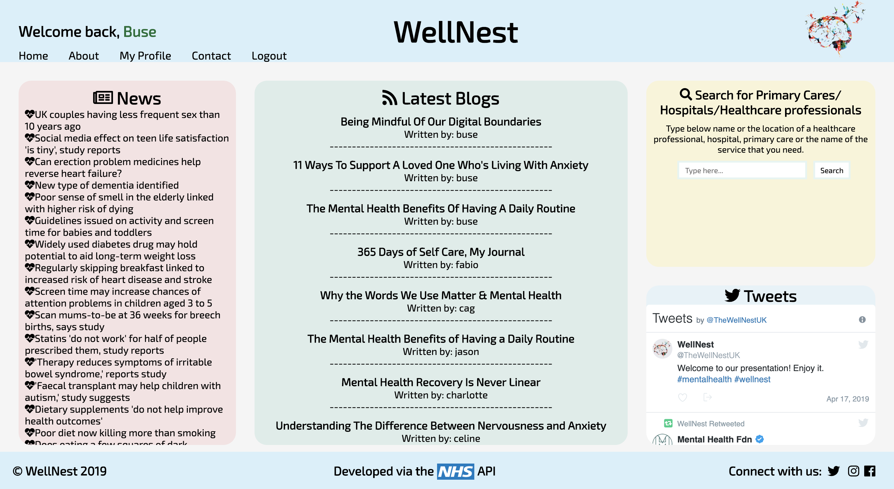
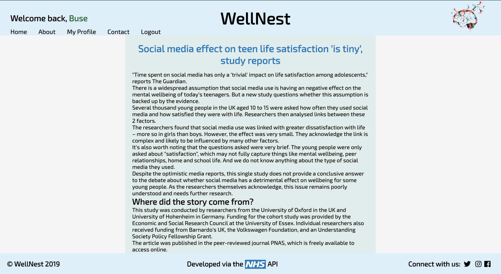
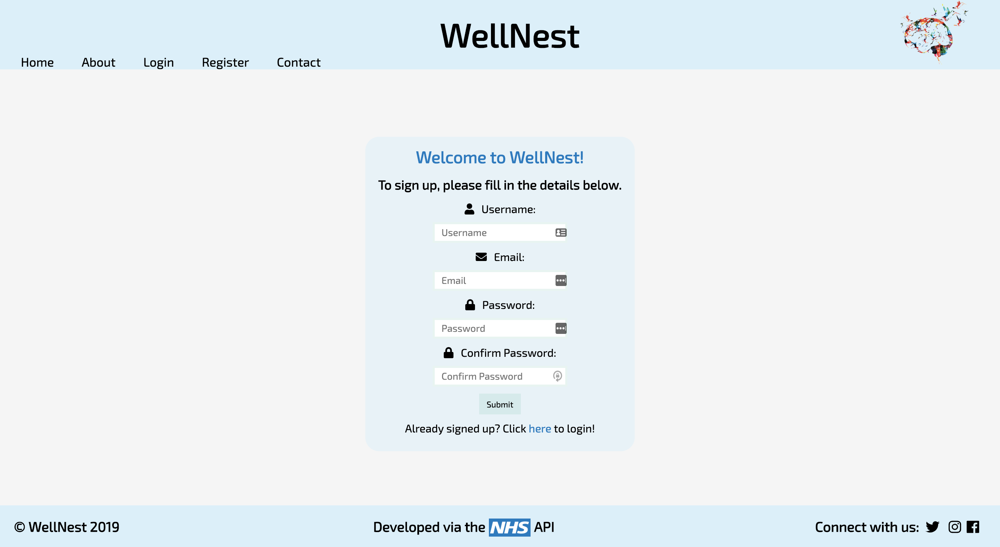
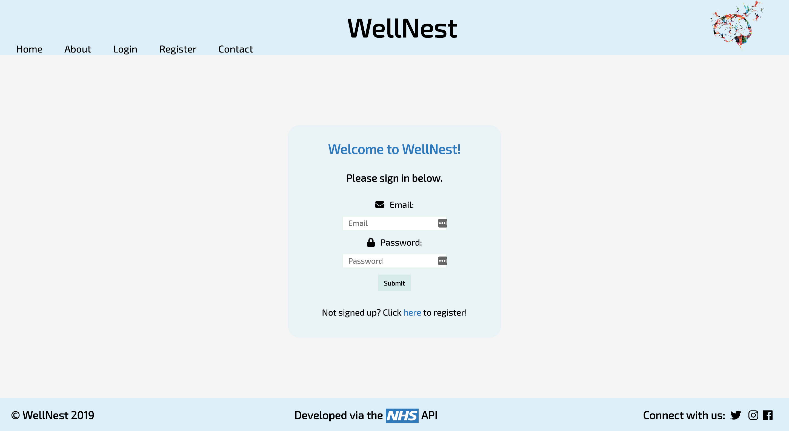
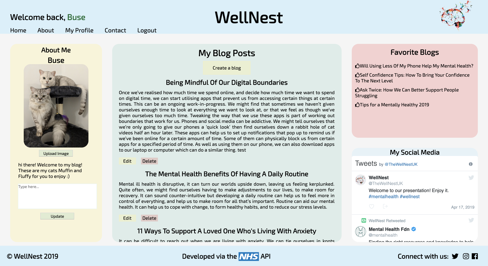
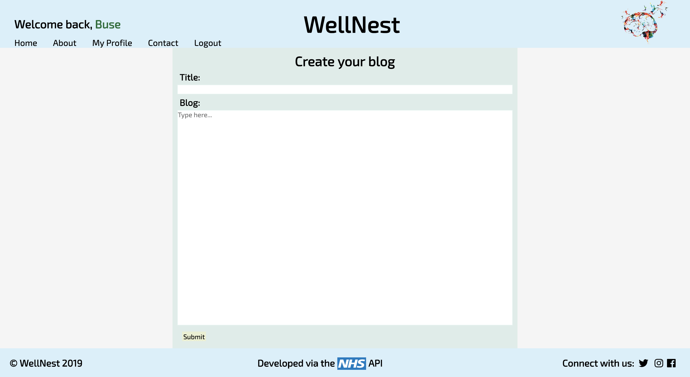
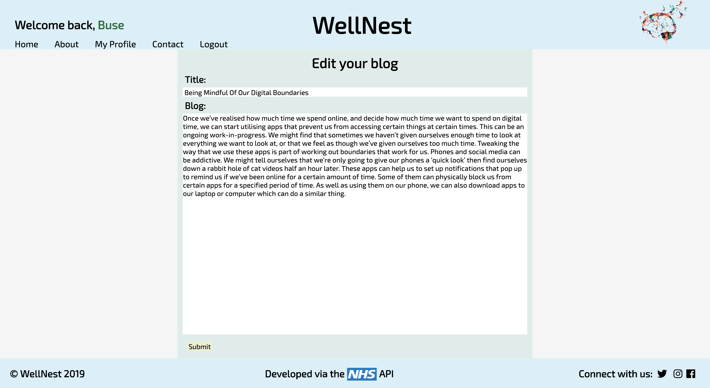
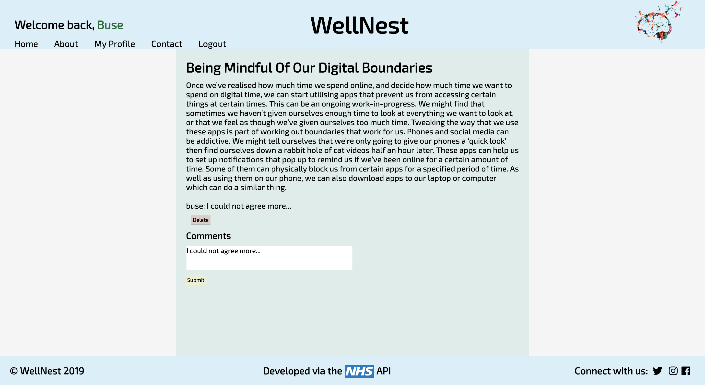
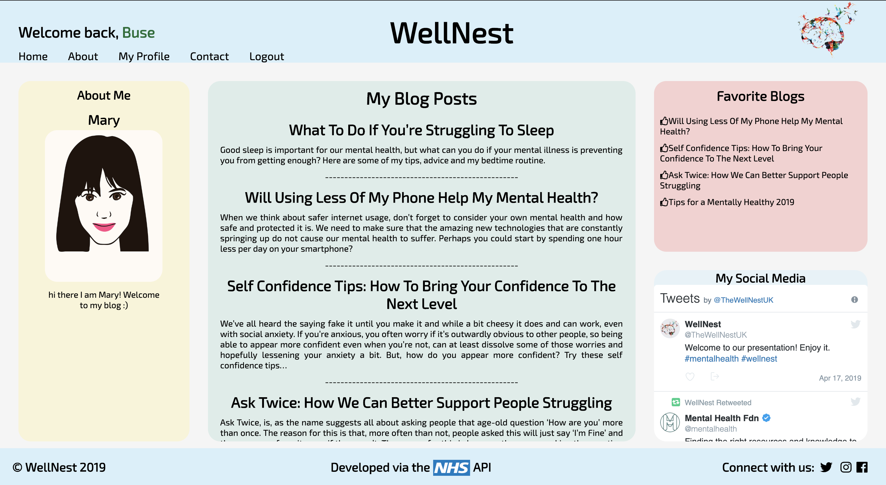

# WellNest

## WDI Project 4 
Project-4

## Goal
To build a full-stack application with a backend and front-end by using a Python Flask API and serving data from a Postgres database. I worked with another student to create the app.

## About WellNest - An Overview

Wellnest is a platform created to provide a safe space for fostering mental health awareness and understanding of mental health disorders.

Our goal is to help you find your wings by initiating and maintaining a positive dialogue among peer support networks. This effort hopes to encourage communication surrounding mental health and wellness in order to break the stigma.

Guests can stay up to date with relevant news provided by the NHS or write blogs about their experiences.

### Website
https://wellnest-mh.herokuapp.com/

## Timeframe

* 8 days

## Technologies Used
* HTML5
* CSS - SASS
* JavaScript (ES6)
* React
* Python
* PostgreSQL
* API: NHS
* Insomnia
* FileStack

## Process
### Home
  Users can access to the news, search functionality and the tweets on the home page without registering to the website. The titles of the blogs latest 20 blogs are visible on the home page, however to view a blog, the user must be registered to the website. The users can search for primary cares, hospitals and healthcare professionals by using the search function


### News Page
This is how the news page looks when the user clicks to read an article on the home page.


### Register
Users can register to the website by clicking "register" on the navbar. Username and the email must be unique to be able to register to the website.



### Login
Once registered, users can log in to the website.


### Users' profile
Once logged-in, the users are allowed to create their own profile page. They can add a profile photo. We used filestack for this function. They can update their "about-me" section. They will be able to view their favourite blogs(currently hard coded in). They will also be able to share their own tweets on their page if they want(currently showing the twitter page of the website).


### Create a blog
Once logged-in, the users can create a blog via their profile page. When "create a blog" button is clicked, the users will be navigated to the "create your blog" page. Here they can create a new blog. Once a blog is created and submitted, it will come up on the home page as well as users own profile.


### Edit a blog
Users can edit their own blogs if they click the "edit" button for each blog. This will navigate the website to the "edit your blog" page which will populate the previous data from the blog. Only the owner of the blogs can edit and delete their blogs.


### View a blog
Users can view other users' profile pages and blogs if they are logged-in. They can view other profiles/blogs by clicking their name on the home page.


### View others' profiles
This is how others profile look like. Only the owner of that profile page can update their "about-me" section, can edit and delete their blogs. Other users are only allowed to comment and to delete their own comments from other blogs.


## Challenges
* Getting the news article as a text in a different route. The news article was written in HTML in the API. Managed to to change this into text.
* Search functionality at home page.

## Wins
* Created a fully Functioning mental blog app.
* Showing a news article in a different tab. I used the code below to convert the article that was written in HTML into text:

```javascript
import React from 'react'
import Nav from './lib/nav'
import Header from './headerFooter/header'

import axios from 'axios'

class News extends React.Component {
  constructor() {
    super()

    this.state = {}

  }

  news() {
    console.log('getting the newss')
    axios.post('/api/news-article', {url: this.props.location.state.articleURL})
      .then(res => {
        console.log('HERE')
        console.log(res.data)
        this.setState({article: res.data})
      })
      .catch(err => this.setState({ error: err.messsage }))
  }

  componentDidMount() {
    this.news()
  }

  render() {
    return(
      <div>
        <Header />
        <Nav />
        <main>
          <div className="newsPage">
            <div className = "title">
              <h1>{this.state.article && this.state.article.headline}</h1>
            </div>
            <div className="article" dangerouslySetInnerHTML={{__html: this.state.article && this.state.article.mainContentOfPage[0].text}} />
          </div>
        </main>
      </div>
    )
  }
}

export default News
```


## Future Features
* Add a like button for the articles. Whenever a user likes an article, this article will populate in their "favourite articles" section on their profile page.
Favourite articles are currently hard coded in.
* Add a search functionality to the blogs on home page, as it is limited to show the latest 20 blogs.
* Add "written by" into "view a blog" page.
