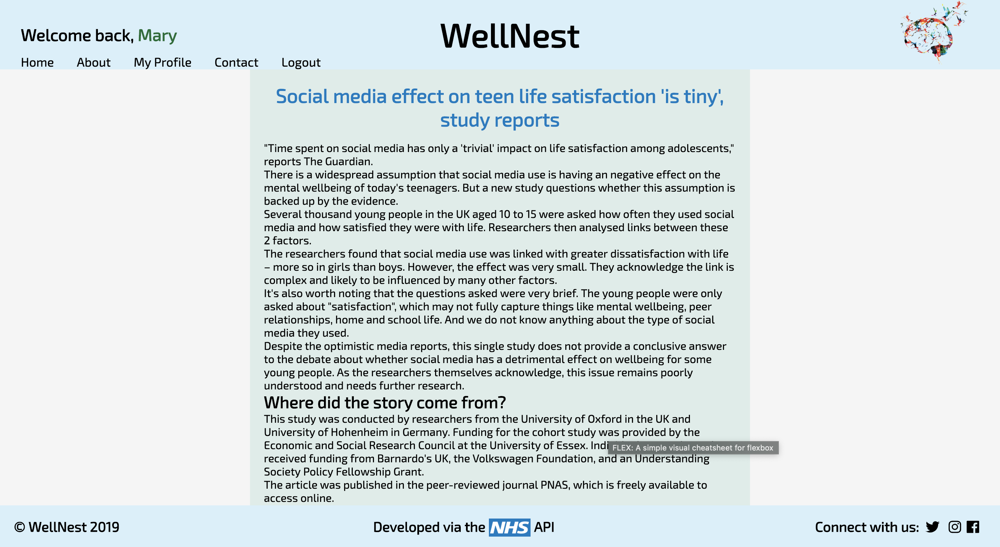

# WellNest

## WDI Project 4 

## About WellNest - An Overview

Wellnest is a platform created to provide a safe space for fostering mental health awareness and understanding of mental health disorders.

Our goal is to help you find your wings by initiating and maintaining a positive dialogue among peer support networks. This effort hopes to encourage communication surrounding mental health and wellness in order to break the stigma.

Guests can stay up to date with relevant news provided by the NHS or write blogs about their experiences.

### Website
https://wellnest-mh.herokuapp.com/

## Timeframe

* 8 days

## Technologies Used
* HTML5
* CSS - SASS
* JavaScript (ES6)
* React
* Python
* PostgreSQL
* API: NHS
* Insomnia
* FileStack

## App Overview & User experience
### Home


### News Page


### Register


### Login


### Users' profile


### Create a blog


### Edit a blog


### View a blog


### View others' profiles


## Challenges
* Getting the news article as a text in a different route. The news article was written in HTML in the API. Managed to to change this into text.
* Search functionality at home page.

## Wins
* Created a fully Functioning mental blog app.
* Showing a news article in a different tab. I used the code below to convert the article that was written in HTML into text:

```javascript
import React from 'react'
import Nav from './lib/nav'
import Header from './headerFooter/header'

import axios from 'axios'

class News extends React.Component {
  constructor() {
    super()

    this.state = {}

  }

  news() {
    console.log('getting the newss')
    axios.post('/api/news-article', {url: this.props.location.state.articleURL})
      .then(res => {
        console.log('HERE')
        console.log(res.data)
        this.setState({article: res.data})
      })
      .catch(err => this.setState({ error: err.messsage }))
  }

  componentDidMount() {
    this.news()
  }

  render() {
    return(
      <div>
        <Header />
        <Nav />
        <main>
          <div className="newsPage">
            <div className = "title">
              <h1>{this.state.article && this.state.article.headline}</h1>
            </div>
            <div className="article" dangerouslySetInnerHTML={{__html: this.state.article && this.state.article.mainContentOfPage[0].text}} />
          </div>
        </main>
      </div>
    )
  }
}

export default News
```


## Future Features
* Add a like button for the articles. Whenever a user likes an article, this article will populate in their "favourite articles" section on their profile page.
Favourite articles are currently hard coded in.
* Add a search button to the blogs at home page, as it is limited to show the latest 20 blogs.
* Add "written by" into "view a blog" page.
